# **Buenas prácticas para el diseño de Servicios RESTful (OAS 3)**  

# Tabla de contenido
- [**Buenas prácticas para el diseño de Servicios RESTful (OAS 3)**](#buenas-prácticas-para-el-diseño-de-servicios-restful-oas-3)
- [Tabla de contenido](#tabla-de-contenido)
- [1. Conceptos generales](#1-conceptos-generales)
  - [1.1. Qué es un API](#11-qué-es-un-api)
  - [1.2. Qué es REST](#12-qué-es-rest)
  - [1.3. Qué es RESTful](#13-qué-es-restful)
  - [1.4. REST vs RESTful](#14-rest-vs-restful)
    - [Agregar un nuevo item](#agregar-un-nuevo-item)
    - [Consultar un item](#consultar-un-item)
    - [Borrar un item](#borrar-un-item)
    - [Actualizar un item](#actualizar-un-item)
  - [1.5. Modelo de Madurez de Richardson](#15-modelo-de-madurez-de-richardson)
- [2. REST API](#2-rest-api)
  - [2.1. Qué es Endpoint](#21-qué-es-endpoint)
  - [2.2. Qué es Resource](#22-qué-es-resource)
    - [Usa sustantivos](#usa-sustantivos)
    - [Utiliza nombres intuitivos, claros e integros](#utiliza-nombres-intuitivos-claros-e-integros)
    - [Utiliza separador de barra inclinada para jerarquías](#utiliza-separador-de-barra-inclinada-para-jerarquías)
    - [Separa palabras con guiones](#separa-palabras-con-guiones)
    - [Usa letras minúsculas](#usa-letras-minúsculas)
    - [Evita los caracteres especiales](#evita-los-caracteres-especiales)
    - [Evita las extensiones de archivo](#evita-las-extensiones-de-archivo)
  - [2.3. Qué es Request](#23-qué-es-request)
  - [2.4. Qué es Response](#24-qué-es-response)
  - [2.5. Ejemplo de operación GET](#25-ejemplo-de-operación-get)
  - [2.6. Ejemplo de operación PUT](#26-ejemplo-de-operación-put)
  - [2.7. Ejemplo de operación POST](#27-ejemplo-de-operación-post)
  - [2.8. Ejemplo de operación DELETE](#28-ejemplo-de-operación-delete)
- [3. Documentar REST API](#3-documentar-rest-api)
  - [3.1. Json](#31-json)
  - [3.2. YAML](#32-yaml)
  - [3.3. OpenAPI Specification (OAS)](#33-openapi-specification-oas)
  - [3.4. Relación de REST API y OpenAPI](#34-relación-de-rest-api-y-openapi)
- [4. Creación de REST API (OAS 3)](#4-creación-de-rest-api-oas-3)
  - [4.1. Análisis del requerimiento](#41-análisis-del-requerimiento)
  - [4.2. Parámetros de entrada](#42-parámetros-de-entrada)
  - [4.3. Parámetros de salida](#43-parámetros-de-salida)
  - [4.4 Definición del servicio](#44-definición-del-servicio)
    - [Definición base](#definición-base)
    - [Metadata](#metadata)
    - [Server](#server)
    - [Tags](#tags)
    - [Paths \& Operations](#paths--operations)
    - [Parameters](#parameters)
  - [4.5. Operación GET](#45-operación-get)
    - [Media Types](#media-types)
    - [Responses](#responses)
    - [Input \& Output Schemas](#input--output-schemas)
  - [4.6. Operación POST](#46-operación-post)
  - [4.7. Operación PUT](#47-operación-put)
  - [4.8. Operación DELETE](#48-operación-delete)
- [5. Ejemplo de especificación REST API OAS 3.0.1](#5-ejemplo-de-especificación-rest-api-oas-301)
- [6. Anexos](#6-anexos)
  - [6.1 HTTP/1.1](#61-http11)
  - [6.2 Response Codes](#62-response-codes)
  - [6.3 Best Practices](#63-best-practices)
    - [REST API Best Practices - REST Endpoint Design Examples](#rest-api-best-practices---rest-endpoint-design-examples)
    - [9 Trending Best Practices for REST API Development](#9-trending-best-practices-for-rest-api-development)
    - [RESTful web API design](#restful-web-api-design)
    - [Best Practices in API Design](#best-practices-in-api-design)


# 1. Conceptos generales


## 1.1. Qué es un API

**Application Programming Interface**

Es un conjunto de definiciones y protocolos que se utilizan para desarrollar software y que permite la comunicación entre dos aplicaciones de software a través de un conjunto de reglas.

**Tipos de API**

Existen varios tipos de API, por ejemplo **Java API** que son interfaces con clases que permiten a los objetos hablar entre si, esto dentro del lenguaje de programación Java. Además de las API's centradas en programación, están las Web APIs como lo es Simple Object Access Protocol (`SOAP`), Remote Procedure Call (`RPC`) y quizá la más popular, Representational State Transfer (`REST`).

**El API moderna**

A lo largo de los años, lo que es una “API“ con frecuencia se ha descrito como **"cualquier tipo de interfaz de conectividad genérica”** para una aplicación.

De forma reciente las APIs modernas han tomado algunas características que las hacen extraordinariamente valiosas y utiles.

* Se adhieren a estándares y arquitecturas (típicamente `HTTP` y `REST`), que son “developer-friendly”, de fácil acceso y amplio entendimiento.

* Son tratadas como un “producto” más que como código. 

* Son diseñadas para el consumo de audiencias específicas, documentadas y versionadas de forma que un usuario puede tener ciertas expectativas de su mantenimiento y ciclo de vida.

* Debido a que son mucho más estándarizadas, tienen una disciplina más fuerte para seguridad y gobernabilidad, así como para ser monitoreadas y administradas para desempeño y escalabilidad. 

* Tiene su propio ciclo de desarrollo de software (**S**oftware **D**evelopment **L**ife **C**ycle) https://searchapparchitecture.techtarget.com/feature/5-stages-of-an-API-lifecycle-explained.
  
  * Planning
  * Development
  * Testing
  * Deployment
  * Retirement


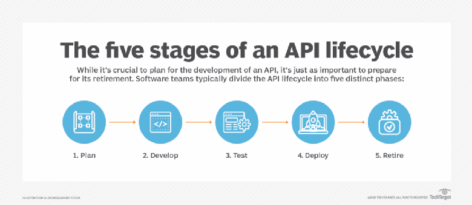


## 1.2. Qué es REST

REST es un acrónimo para **RE**presentational **S**tate **T**ransfer. REST es un tipo de arquitectura para sistemas de hipermedios distribuidos que fue creada por Roy Fielding en el año 2000.

> “REST es un conjunto de restricciones arquitectónicas, no un protocolo ni un estándar.”

Como otros tipos de arquitectura, REST tiene sus propias principios rectores y limitaciones.

Estos principios deben cumplirse si la interfaz de un servicio necesita ser referenciada como RESTful.


[https://restfulapi.net](https://restfulapi.net)

[https://www.redhat.com/en/topics/api/what-is-a-rest-api](https://www.redhat.com/en/topics/api/what-is-a-rest-api)


## 1.3. Qué es RESTful

Para que una API pueda ser considerada RESTful, debe cumplir con los siguientes criterios.

* **Client-server** - Una arquitectura cliente-servidor compuesta por clientes, servidores y recursos, con solicitudes gestionadas a través de HTTP.

* **Stateless** - Comunicación cliente-servidor sin estado, lo que significa que no se almacena información del cliente entre las solicitudes de obtención y cada solicitud es independiente y no está conectada.

* **Cacheable** - Datos almacenables en caché que agilizan las interacciones cliente-servidor.

* **Uniform interface** - Una interfaz uniforme entre los componentes para que la información se transfiera de forma estándar.

	Se puede lograr una interfaz REST uniforme mediante las siguientes cuatro restricciones:

	* **Identificación de recursos**. La interfaz debe poder identificar de forma única cada recurso individual involucrado en la interacción entre el cliente y el servidor.

	* **Manipulación de recursos a través de representaciones**. Los recursos deben tener representaciones uniformes en la respuesta del servidor. Estas representaciones deben usarse para modificar el estado de los recursos en el servidor.

	* **Mensajes auto descriptivos**. Cada representación de recurso debe contener suficiente información para describir cómo procesar el mensaje. También debe proporcionar información de las acciones adicionales que se pueden realizar en el recurso.

	* **Hipermedia como motor del estado de la aplicación**. El cliente debe tener solo el URI inicial de la aplicación. Todos los demás recursos e interacciones deben ser impulsados dinámicamente por la aplicación cliente con el uso de hipervínculos.

* **Layered system** - Un sistema en capas que organiza cada tipo de servidor (los responsables de la seguridad, el equilibrio de carga, etc.) implica la recuperación de la información solicitada en jerarquías, invisibles para el cliente.

* **Code on demand (optional)** - Es la capacidad de enviar código ejecutable desde el servidor al cliente cuando se lo solicite, extendiendo la funcionalidad del cliente.


[https://www.redhat.com/en/topics/api/what-is-a-rest-api](https://www.redhat.com/en/topics/api/what-is-a-rest-api)

[https://restfulapi.net/](https://restfulapi.net/)

[https://blog.ndepend.com/rest-vs-restful/](https://blog.ndepend.com/rest-vs-restful/)


## 1.4. REST vs RESTful

La diferencia entre REST y RESTful puede ser explicada en dos formas.

La respuesta corta es `"REST significa REpresentational State Transfer"`, es un patrón arquitectónico para crear servicios web, por otra parte `"Un servicio RESTful es aquel que implementa ese patrón"`.

La respuesta larga sobre si existe diferencia continúa con definiciones más completas, por lo cual se revisarán los siguientes ejemplos.

**NOTA**: Para saber más sobre RPC validar las siguientes ligas. 

* [Remote Procedure Calls](https://docs.microsoft.com/en-us/windows/win32/rpc/remote-procedure-calls-using-rpc-over-http)

* [RPC over HTTP](https://docs.microsoft.com/en-us/exchange/troubleshoot/administration/rpc-over-http-end-of-support)

### Agregar un nuevo item

<table>
<tr><td>
RPC Over HTTP

```json
POST /inventory HTTP/1.1
GET /inventory HTTP/1.1

{
    "NewItem": {
          "name": "new item",
          "price": "9.99",
          "id": "1001"
      }
}
```

</td>
<td>
RESTful

```json
POST /item HTTP/1.1
 
{
    "Item": {
          "name": "new item",
          "price": "9.99",
          "id": "1001"
      }
} 
```
</td></tr>
</table>

> **NOTA**: Algunas implementaciones de `RPC Over HTTP` aceptan "request" para un nuevo item por medio del método `GET`.


### Consultar un item

<table>
<tr><td>
RPC Over HTTP

```json
POST /inventory HTTP/1.1

{
    "ItemRequest": {
          "id": "1001"
      }
}   
```
</td>
<td>
RESTful

```json
GET /item/1001 HTTP/1.1
```
</td></tr>
</table>


###  Borrar un item

<table>
<tr><td>
RPC Over HTTP

```json
POST /inventory HTTP/1.1
 
{
    "ItemDelete": {
          "id": "1001"
      }
} 
```
</td>
<td>
RESTful

```json
DELETE /item/1001 HTTP/1.1  
```
</td></tr>
</table>

###  Actualizar un item

<table>
<tr><td>
RPC Over HTTP

```json
POST /inventory HTTP/1.1
 
{
    "ItemUpdate": {
          "name": "new item",
          "price": "7.99",
          "id": "1001"
      }
}  
```
</td>
<td>
RESTful

```json
PUT /item HTTP/1.1
 
{
    "Item": {
          "name": "new item",
          "price": "7.99",
          "id": "1001"
      }
}
```
</td></tr>
</table>


**RPC Over HTTP no es REST**. No se está intercambiando el estado de los recursos. Se está llamando a una función con argumentos que se encuentran en un documento Json o argumentos de URL.
> 
> Un servicio **RESTful** tiene un URI para cada item del inventario. 
> 
> La diferencia es importante. En REST, las operaciones utilizan distintas acciones HTTP. Estos verbos corresponden directamente a la actividad de los datos. GET, POST, PUT, DELETE y PATCH tienen contratos específicos. 
>
> La mayoría de las API REST bien diseñadas también devuelven códigos HTTP específicos, según el resultado de la solicitud.

[https://blog.ndepend.com/rest-vs-restful/](https://blog.ndepend.com/rest-vs-restful/)


## 1.5. Modelo de Madurez de Richardson

Es un modelo (desarrollado por *Leonard Richardson*) que desglosa los elementos principales de un enfoque REST en tres capas para determinar la madurez de un servicio.

* `URI` (recursos)
* `HTTP Methods/Verbs`
* `HATEOAS` (hipermedia)

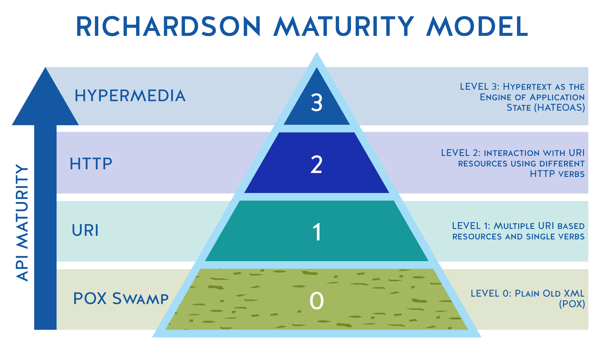


**Nivel 0 - El pantano de POX**

El nivel 0 usa el protocolo de implementación *(normalmente HTTP, pero no tiene por qué serlo)* como un protocolo de comunicación. Es decir, canaliza solicitudes y respuestas a través de su protocolo sin utilizar el protocolo para indicar el estado de la aplicación. Solo utiliza un punto de entrada (URI) y un tipo de método (en HTTP, normalmente es el método `POST`). Ejemplos de estos son `SOAP` y `XML-RPC`.


**Nivel 1 - Recursos**

Cuando el API puede distinguir entre diferentes recursos, se está en el nivel 1. Este nivel usa múltiples URIs, donde cada URI es el punto de entrada a un recurso específico. En lugar de pasar por http://example.org/articles, en realidad distingue entre http://example.org/article/1 y http://example.org/article/2. Aún así, este nivel usa un solo método como `POST`.


**Nivel 2 - Verbos HTTP**

Este nivel indica que el API debe usar las propiedades del protocolo para lidiar con la escalabilidad y las fallas. 

No utiliza un único método `POST` para todos las operaciones, utiliza `GET` cuando solicita recursos y utiliza `DELETE` cuando desea eliminar un recurso. Además, utiliza los códigos de respuesta de su protocolo de aplicación. 

No usa el código `200 (OK)` cuando algo salió mal, por ejemplo. Al hacer esto para el protocolo de aplicación HTTP, o cualquier otro protocolo de aplicación usado, se ha alcanzado el nivel 2.


**Nivel 3 - Controles hipermedia**

El nivel 3, el nivel más alto, utiliza `HATEOAS` (Hypertext As The Engine Of Application State) para lidiar con el descubrimiento de las posibilidades del API hacia los clientes. 

**En resumen:**

* El nivel 1 aborda la cuestión del manejo de la complejidad mediante el uso de divide y vencerás, dividiendo un endpoint de un servicio grande en múltiples recursos.

* El nivel 2 introduce un conjunto estándar de verbos para que manejemos situaciones similares de la misma manera, eliminando variaciones innecesarias.

* El nivel 3 introduce la capacidad de detección, lo que proporciona una forma de hacer que un protocolo sea más autodocumentado.

[https://martinfowler.com/articles/richardsonMaturityModel.html](https://martinfowler.com/articles/richardsonMaturityModel.html)

[https://devopedia.org/richardson-maturity-model](https://devopedia.org/richardson-maturity-model)

[https://restcookbook.com/Miscellaneous/richardsonmaturitymodel/](https://restcookbook.com/Miscellaneous/richardsonmaturitymodel/)


# 2. REST API

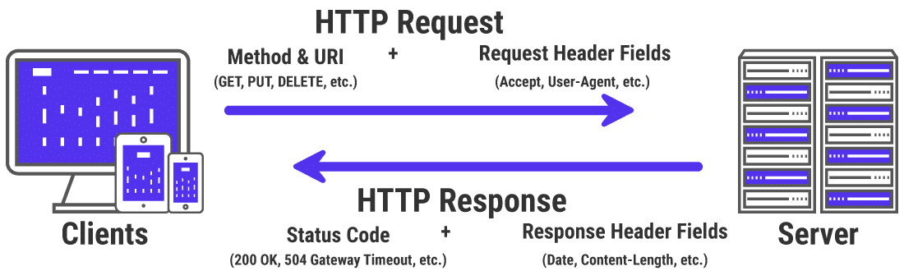

REST es un tipo de Arquitectura de Software Estandarizado.

Beneficios de RESTful Service.

* **Forma de comunicación simple y estandarizada**. No es necesario preocuparse por el formato de datos o formar las peticiones, ya que todo está estandarizado de la forma en que es utilizado en la industria.

* **Escalable y sin estado**. Cuando un servicio crece en complejidad se pueden realizar modificaciones de forma fácil. Por el hecho de que son "sin estado" no es necesario preocuparse por el estatus de los datos y mantener un tracking de los mismos a través de clientes y servidores.

* **Alto desempeño y almacenamiento en cache**.

Cuando se realiza la interacción entre un cliente y un servidor a través de una REST API existen los siguientes elementos a considerar:

* Endpoint
* Resource
* Request
* Response


## 2.1. Qué es Endpoint

Un `endpoint` es un **punto de conexión** que da servicio a un conjunto de recursos REST, por ejemplo:

```
https://empresa.com/api/service-orders
```
|  | |
| --- | --- |
| `api` | Indica la porción API del endpoint. |
| `service-orders` | Es el recurso (**resource**) a consumir. |


## 2.2. Qué es Resource

El concepto fundamental en cualquier API RESTful es el `resource`. Un **recurso** es un objeto con un tipo, datos asociados, relaciones con otros recursos y un conjunto de métodos que operan en él. 

Es similar a una instancia de objeto en un lenguaje de programación orientado a objetos, con la importante diferencia de que solo se definen unos pocos métodos estándar para el recurso (correspondientes a los métodos HTTP estándar `GET`, `POST`, `PUT` y `DELETE`), mientras que una instancia de objeto normalmente tiene muchos métodos.


### Usa sustantivos

En general, las URI deben nombrarse con **sustantivos** que especifiquen el contenido del recurso, en lugar de agregar un verbo para la función que se está realizando. 

Por ejemplo, se debe utilizar https://empresa.com/api/users en lugar de https://empresa.com/api/getUsers. 

Esto se debe a que la funcionalidad **CRUD** (create, read, update, delete) ya debería estar especificada en la solicitud HTTP (por ejemplo, HTTP GET https://empresa.com/api/users).

En general, se prefiere el uso de **sustantivos en plural** a menos que el recurso sea claramente un concepto singular (por ejemplo, https://empresa.com/api/users/admin para el usuario administrativo).

### Utiliza nombres intuitivos, claros e integros

Al nombrar los endpoints del API REST, se debe utilizar nombres de URI que sean intuitivos y claros; idealmente, algo que los terceros puedan adivinar incluso si nunca antes han usado el API. 

En particular, se evita las abreviaturas y la taquigrafía (por ejemplo, https://empresa.com/api/users/123/fn en lugar de https://empresa.com/api/users/123/first-name), a menos que la abreviatura sea el término preferido o más popular, en cuyo caso se debe utilizar (por ejemplo, https://empresa.com/api/users/ids en lugar de https://empresa.com/api/users/identification-numbers).

### Utiliza separador de barra inclinada para jerarquías

Las API REST suelen estructurarse en una jerarquía: por ejemplo, https://empresa.com/api/users/123/first-name recuperará el *nombre del usuario* con el número de identificación 123.

La barra inclinada ("/") debe utilizarse para navegar por esta jerarquía, moviéndose de lo general a lo específico cuando se va de izquierda a derecha en el URI.

### Separa palabras con guiones

Cuando un endpoint del API REST contiene varias palabras (por ejemplo, https://empresa.com/api/users/123/first-name), debe separar las palabras con guiones. Por lo general, esto es más claro y más fácil de usar que el uso de guiones bajos (por ejemplo, first_name) o mayúsculas y minúsculas (por ejemplo, firstName), que no se recomienda debido al uso de letras mayúsculas.

### Usa letras minúsculas

Siempre que sea posible, usa letras minúsculas en las URL del API. Esto se debe principalmente a que la especificación **RFC 3986** para estándares URI indica que los URI distinguen entre mayúsculas y minúsculas. Las letras minúsculas para los URI se utilizan ampliamente y también ayudan a evitar confusiones sobre las mayúsculas inconsistentes.

### Evita los caracteres especiales

Los caracteres especiales no solo son innecesarios, también pueden resultar confusos para los usuarios y técnicamente complejos. Debido a que las URL solo se pueden enviar y recibir utilizando el conjunto de caracteres ASCII, todas las URL de su API deben contener solo caracteres ASCII.

### Evita las extensiones de archivo

Si bien el resultado de una llamada a la API puede ser un tipo de archivo en particular, las extensiones de archivo se consideran en gran medida innecesarias en los URI: agregan longitud y complejidad. 

Por ejemplo, debe utilizar https://empresa.com/api/users en lugar de https://empresa.com/api/users.xml. De hecho, el uso de una extensión de archivo puede crear problemas para los usuarios finales si cambia el tipo de archivo de los resultados más adelante.


[https://restful-api-design.readthedocs.io/en/latest/resources.html](https://restful-api-design.readthedocs.io/en/latest/resources.html)

[https://blog.dreamfactory.com/best-practices-for-naming-rest-api-endpoints/](https://blog.dreamfactory.com/best-practices-for-naming-rest-api-endpoints/)

## 2.3. Qué es Request

Un `request` es el mensaje enviado por el cliente hacia el servidor. 

* Permite identificar el tipo de `acciones` o `verbos` que queremos realizar.
* Existe la denominación CRUD que identificada las acciones principales que se quieren realizar cuando se están comunicando un cliente y un servidor.
* En una REST API el equivalente a CRUD son los "métodos/operaciones" HTTP.

| Operación | Método HTTP |
| --- | --- |
| Create | POST |
| Read | GET |
| Update | PUT |
| Delete | DELETE |

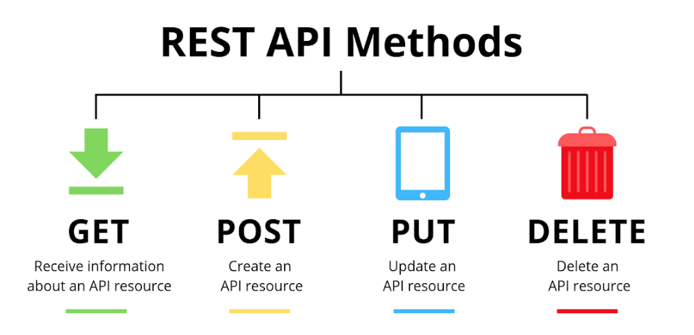

[https://developer.mozilla.org/en-US/docs/Web/HTTP/Methods](https://developer.mozilla.org/en-US/docs/Web/HTTP/Methods)

**Partes que conforman un Request**.

| | |
| --- | --- |
| `Operation` | Una operación es un método HTTP. |
| `Endpoint` | Es el endpoint del REST API al que nos vamos a comunicar. |
| `Parameters or Body` | Son los datos que se requieren enviar en el "request". |
| `Headers` | Es una parte especial de un "request" que puede tener datos como `API Key` o algún dato de autenticación. |


## 2.4. Qué es Response

* Es la información retornada por el servidor.
* Los datos típicamente se encuentran en forma de datos Json.
* Códigos de respuesta HTTP.

**Partes que conforman un Response**.

| | |
| --- | --- |
| `HTTP Response Code` | Es el código de respuesta de HTTP. |
| `Body` | Son los datos que regresa el servicio consultado. |
| `Headers` | Es una parte especial de un "response" que puede tener datos como `Content-type`, `date` o algún dato proporcionado por el servicio consultado. |


**Códigos de respuesta de estatus**.

| Tipo | Rango de códigos |
| --- | --- |
| Respuestas de información | 100 - 199 |
| Respuestas exitosas | 200 - 299 |
| Mensajes de redireccionamiento | 300 - 399 |
| Respuestas de error del cliente | 400 - 499 |
| Respuestas de error del servidor | 500 - 599 |

[https://developer.mozilla.org/en-US/docs/Web/HTTP/Status
](https://developer.mozilla.org/en-US/docs/Web/HTTP/Status
)


## 2.5. Ejemplo de operación GET

|||
|---|---|
| Escenario | Obtener todas las **Ordenes de Servicio** que existen en el sistema. |
| Operation | **GET** |
| Endpoint | http://empresa.com/api/service-orders |
| Parameter | No se requiere. |
| Body | No se requiere. |
Response
```json
	[
		{
			"id": 1,
			"soType": "OS",
			"phoneNumber": "5400000001",
			"imsProfile": "Huawei",
			"data": ""
		},
		{
			"id": 2,
			"soType": "OS",
			"phoneNumber": "5400000999",
			"imsProfile": "Huawei",
			"data": "Data available"
		}
	]
```

## 2.6. Ejemplo de operación PUT

|||
|---|---|
| Escenario | Actualizar una **Orden de Servicio** que existe en el sistema. |
| Operation | **PUT** |
| Endpoint | http://empresa.com/api/service-orders/1 |
| Parameter | 1 |
Body
```json
	{
		"soType": "OS",
		"phoneNumber": "5400000001",
		"imsProfile": "HWTC",
		"data": ""
	}
```					
Response
```json
	{
		"id": 1,
		"soType": "OS",
		"phoneNumber": "5400000001",
		"imsProfile": "HWTC",
		"data": ""
	}
```

## 2.7. Ejemplo de operación POST

|||
|---|---|
| Escenario | Crear una **Orden de Servicio**. |
| Operation | **POST** |
| Endpoint | http://empresa.com/api/service-orders |
| Parameter | No se requiere. |
Body
```json
	{
		"soType": "OS",
		"phoneNumber": "5400000555",
		"imsProfile": "Huawei",
		"data": "Demo"
	}
```
Response
```json
	{
		"id": 3,
		"soType": "OS",
		"phoneNumber": "5400000555",
		"imsProfile": "Huawei",
		"data": "Demo"
	}
```

## 2.8. Ejemplo de operación DELETE

|||
|---|---|
| Escenario | Eliminar una **Orden de Servicio** que existe en el sistema. |
| Operation | **DELETE** |
| Endpoint | http://empresa.com/api/service-orders/3 |
| Parameter | 3 |
| Body | No se requiere. |
Response
```json
	{
		"code": 0,
		"message": "done"
	}
```
# 3. Documentar REST API

## 3.1. Json

**J**ava**S**cript **O**bject **N**otation.

Es un formato ligero de intercambio de datos. 
Es fácil para los humanos leerlo y escribirlo.
Es fácil para las máquinas hacer un parseo y generarlo.

Json está construido en dos estructuras: una colección de pares nombre/valor y una lista ordenada de valores.

La representación Json de las estructuras es la siguiente:

> Un objeto es un conjunto desordenado de pares de nombre/valor. Un objeto comienza con **{** llave izquierda y termina con **}** llave derecha. Cada nombre va seguido de **:** dos puntos y los pares de nombre/valor están separados por una **,** coma.

[https://www.json.org/json-en.html](https://www.json.org/json-en.html)

## 3.2. YAML

**Y**AML **A**in't **M**arkup **L**anguage.

Es un estándar de serialización de datos amigable con el humano (`human friendly`) para una amplia lista de lenguajes de programación, que incluye a los más comerciales en la industria.

Se utiliza en archivos de configuración y en las aplicaciones se usa para almacenar y transmitir datos.

YAML también tiende a ser más fácil de leer (`human readable`) que Json.

Siempre que se trabaja con YAML es de suma importancia considerar las reglas de sintaxis.

[https://yaml.org](https://yaml.org)

[https://elcodigok.blogspot.com/2014/01/el-formato-de-archivo-yaml.html](https://elcodigok.blogspot.com/2014/01/el-formato-de-archivo-yaml.html)

## 3.3. OpenAPI Specification (OAS)

**Historia**

El proyecto **Swagger API** se creó en 2010 para automatizar la documentación y la generación del SDK (framework) de clientes de API’s. 

Se diseñó un formato sencillo para describir la interfaz en Json o YAML, pero lo suficientemente “formal” para que las máquinas lo puedan utilizar para crear Proxys (para los cliente) y Skeletons (para los servidores).

El éxito de Swagger fue tal que se convirtió en un estándar “de facto”.

En marzo de 2015 `SmartBear Software` adquiere la **Swagger Specification**.

En noviembre de 2015 `SmartBear Software` anuncia la creación de una nueva organización llamada `OpenAPI Initiative` bajo el sponsorship de `Linux Foundation`.

En enero de 2016 **Swagger Specification** fue renombrada por **OpenAPI Specification** (OAS).


**Herramientas Swagger**

Swagger [https://swagger.io/](https://swagger.io/) es un proyecto utilizado para describir y documentar RESTful APIs.

El editor de Swagger fue el primer editor construido para el diseño de APIs con la especificación OpenAPI (**OAS**).

Se define como un framework de documentación de API que permite:

* Modelar APIs con exactitud

	El diseño de APIs es propenso a errores, es complejo, consume tiempo para ubicar y rectificar los errores cuando se hace el modelado.
	
	El editor valida el diseño en tiempo real, valida el cumplimiento OAS y provee retro alimentación visual conforme se avanza.

* Visualizar durante el diseño

	Las mejores APIs son diseñadas cuando se centran en las necesidades del usuario final.

* Estandarizar el estilo de diseño a través de los equipos.

	Entregar APIs que comparten comportamientos comunes, patrones y una interfaz RESTful consistente, lo cual facilitará el trabajo de la gente que construye y los consumidores que quieren utilizarlas.

La creación de la documentación puede ser de dos formas:

* Top-Down

	Se describe la Rest API en Swagger y a partir de esta se crea la implementación.

* Bottom-Up

	Se crear la implementación del servicio y se documenta el código para generar la documentación Swagger.

[https://swagger.io/solutions/api-design/](https://swagger.io/solutions/api-design/)

[https://www.genbeta.com/desarrollo/openapi-estandarizando-contratos-api-entrevista-a-pedro-j-molina](https://www.genbeta.com/desarrollo/openapi-estandarizando-contratos-api-entrevista-a-pedro-j-molina)

OpenAPI permite definir la especificación de una interfaz RESTful para el desarrollo y consumo de un API por medio de un mapeo efectivo de todos los recursos y operaciones asociados con la interfaz.

Es un estándar para definir contratos de API, los cuales describen la interfaz de los servicios que se van a consumir.

Permite formalizar la definición (contrato).

El objetivo de OpenAPI es construir un estándar en la definición de las APIs para humanos, pero haciendo hincapié en la interfaz para máquinas.

## 3.4. Relación de REST API y OpenAPI

* **OpenAPI specification** define cómo describir una interfaz REST API.
* Se utiliza **OpenAPI definition** para describir lo que un API o servicio puede hacer.
* **OpenAPI definition** es un archivo típicamente YAML o Json.
* Describe:
	* Recursos (properties o data types)
	* Endpoints
	* Operations
	* Parameters
	* Authentication / Authorization

**Beneficios**

* Es un formato estandarizado para describir REST API.
	- Puede ser leído por humanos o máquinas.
	- La definición puede ser consumida por DevOps o un proceso automatizado.
* Guía
	- Permite a alguien hacer referencia a la definición OpenAPI para entender y utilizar el servicio o REST API.
* Extiende el REST API con herramientas.
	- Las herramientas pueden tomar la definición OpenAPI como entrada y producir ciertos artefactos.
	- **API Validator** realiza validaciones para asegurarse que la REST API está cumpliendo con cierto conjunto de estándares de la industria.
	- **API doc generator** genera la documentación REST API que describe de forma clara y exacta lo que la REST API realiza.
	- **SDK generator** genera librerias de cliente en el lenguaje que se indique y que permite consumir la REST API.

**OpenAPI Specification**

* OAS 2.0 - Anteriormente conocida como `Swagger RESTful API Documentation Specification`.
```yaml
swagger: '2.0'
info:
  title: EMPRESA - Ordenes de Servicio
  version: 1.0.0

host: empresa.com
basePath: /api
schemes:
- https

paths:
  /service-orders:
  ...
```

* OAS 3.x
```yaml
openapi: 3.0.1
info:
  title: EMPRESA - Ordenes de Servicio
  version: 1.0.0

servers:
- url: https://empresa.com/api

paths:
  /service-orders:
  ...
```
[https://swagger.io/resources/open-api/](https://swagger.io/resources/open-api/)

[https://www.genbeta.com/desarrollo/openapi-estandarizando-contratos-api-entrevista-a-pedro-j-molina](https://www.genbeta.com/desarrollo/openapi-estandarizando-contratos-api-entrevista-a-pedro-j-molina)


# 4. Creación de REST API (OAS 3)

## 4.1. Análisis del requerimiento

La creación de un API inicia de un `requerimiento funcional`, por ejemplo:

**Descripción del servicio**

    Crear un servicio que permita realizar operaciones CRUD sobre una "Orden de Servicio" (ServiceOrder).

**Parámetros de entrada**

| Parámetro | Tipo | Descripción | Mandatorio |
| --- | --- | --- | --- |
| Tipo de orden servicio | cadena | Tipo de Orden de Servicio | sí |
| Número de teléfono | cadena | Referencia del servicio | sí |
| Perfil IMS | cadena | Nombre del perfil IMS | sí |
| Datos generales | cadena | Información adicional del servicio | no |

**Parámetros de salida**
| Parámetro | Tipo | Descripción | Mandatorio |
| --- | --- | --- | --- |
| ID | integer | Identificador único de la Orden de Servicio | sí |
| Tipo de orden servicio | cadena | Tipo de Orden de Servicio | sí |
| Número de teléfono | cadena | Referencia del servicio | sí |
| Perfil IMS | cadena | Nombre del perfil IMS | sí |
| Datos generales | cadena | Información adicional del servicio | no |

En este ejemplo, `el requerimiento funcional carece de ciertos detalles en los parámetros de entrada y salida`, por lo cual se necesita hacer una proceso de análisis en conjunto con el dueño del requerimiento para poder llegar al detalle "mínimo necesario" para definir una API funcional.

Dado que se trabaja bajo estándares se deben considerar los siguientes puntos:

* El nombre del modelo (`Model`) / esquema (`Schema`) debe seguir con convenciones de nomenclatura de nombrado de clases.

> Los nombres de las clases deben ser sustantivos, en mayúsculas y minúsculas, con la primera letra de cada palabra interna en mayúscula. Trate de que los nombres de sus clases sean simples y descriptivos. Utilice palabras completas: evite las siglas y abreviaturas. [https://www.oracle.com/java/technologies/javase/codeconventions-namingconventions.html](https://www.oracle.com/java/technologies/javase/codeconventions-namingconventions.html)

* Los nombres de los parámetros deben seguir la nomenclatura `camelCase`. Se recomienda que los nombres sean en idioma inglés.

> Es la práctica de escribir frases sin espacios ni puntuación, lo que indica la separación de palabras con una sola letra en mayúscula, y la primera palabra que comienza con cualquier caso. [https://en.wikipedia.org/wiki/Camel_case](https://en.wikipedia.org/wiki/Camel_case)


## 4.2. Parámetros de entrada

Una vez que se ha complementado la información de los parámetros, se puede iniciar el proceso de diseño de los modelos necesarios para el negocio. El recurso que se va a construir será definido como `ServiceOrder`.


**`ServiceOrder`**

| Parámetro | Tipo | Descripción | Mandatorio | Ejemplo |
| --- | --- | --- | --- | --- |
| id | integer | Identificador único de la Orden de Servicio | no | 1 |
| soType | string: min 2, max 10| Tipo de Orden de Servicio | sí | OS |
| phoneNumber | string: min 10, max 10| Referencia del servicio | sí | 5400000555 |
| imsProfile | string: min 5, max 10| Nombre del perfil IMS | sí | Huawei |
| data | string: min 0, max 50| Información adicional del servicio | no | Datos generales del servicio |

## 4.3. Parámetros de salida

Como parte del proceso de diseño del API es importante identificar todos los modelos que están asociados a las respuestas del servicio.

En este caso se identifica una respuesta que implica una colección de `ServiceOrder` y una respuesta "genérica" del servicio.

**`ServiceOrderArray`**
| Parámetro | Tipo | Descripción | Mandatorio | Ejemplo |
| --- | --- | --- | --- | --- |
| collection | array ServiceOrder| Arreglo de Ordenes de Servicio | no | |

**`ApiResponse`**
| Parámetro | Tipo | Descripción | Mandatorio | Ejemplo |
| --- | --- | --- | --- | --- |
| code | string: min 6, max 7 | Código de respuesta retornada por el servicio | sí | 997-20 |
| message | string: min 1, max 100| Mensaje informativo retornado por el servicio | sí | Solicitud procesada por el servicio. |

## 4.4 Definición del servicio

La documentación oficial para "documentar" una API se encuentra en:


* [OpenAPI Initiative](https://www.openapis.org/)
* [OpenAPI Specification v3.1.0](https://spec.openapis.org/oas/v3.1.0)

La documentación proporcionada por swagger.io se encuentra en:


* [OpenAPI Specification](https://swagger.io/resources/open-api/)
* [OAS 2.0](https://swagger.io/specification/v2/)
* [OAS 3.0](https://swagger.io/specification/)

### Definición base

Todo servicio REST contiene una `definición base` con la cual se crea el API, en esta definición existen elementos que son los **mínimos requeridos** para representar un servicio.

```yaml
openapi: 3.0.1
info:
  title: EMPRESA - Ordenes de Servicio
  version: 1.0.0
  
paths:
  /service-orders:
    get:
      responses:
        200:
          description: Operación exitosa.
```

En esta definición se puede ver que se expone un servicio con la especificación `OpenAPI 2.0` con un titulo `EMPRESA - Ordenes de Servicio` en su versión `1.0.0` y que se está exponiendo el recurso `service-orders` a través de la operación `get`.

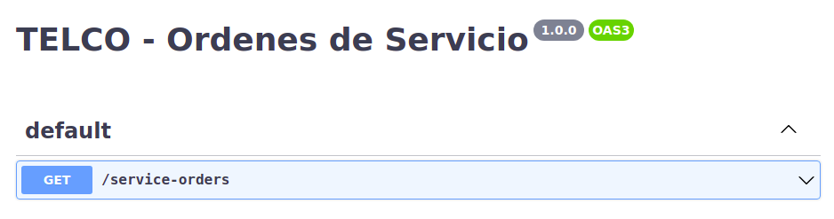

Es importante hacer notar que aunque la definición previa es correcta, carece de datos que ayudan a darle más claridad y usabilidad al servicio.

### Metadata

Es el conjunto de datos que ayudan a definir el servicio y permiten agregar información sobre la finalidad del mismo.

```yaml
openapi: 3.0.1
info:
  title: EMPRESA - Ordenes de Servicio
  description: Administración de Ordenes de Servicio.
  contact:
    name: Desarrollo
    email: development@empresa.com
  version: 1.0.0
```

En esta definición se puede ver que se expone un servicio con la especificación `OpenAPI 3.0` con un titulo `EMPRESA - Ordenes de Servicio` en su versión `1.0.0`, además se indica la `descripción` así como los datos de `contacto` del mismo.


### Server

Es el conjunto de datos que ayudan a definir el servidor (servidores) en el que se accede al servicio.

```yaml
servers:
- url: http://development.empresa.com/api
  description: Servidor de Desarrollo
- url: https://staging.empresa.com/api
  description: Servidor de Pruebas
- url: https://empresa.com/api
  description: Servidor de Producción
```

En esta definición se puede ver que el servicio será expuesto en tres servidores. 

Es importante notar que todos los recursos que se expongan serán accedidos a partir de esta definición, es decir, a través de las siguientes URLs.

> http://development.empresa.com/api/
> 
> https://staging.empresa.com/api/
> 
> https://empresa.com/api/


### Tags

Es el conjunto de datos que permite agrupar las operaciones de acuerdo a la funcionalidad que cubren.

```yaml
tags:
- name: Orden de Servicio
  description: Todos las operaciones asociadas al recurso Orden de Servicio.
```
En esta definición se puede ver que las operaciones creadas estarán asociados a `service-orders`, solo falta asociar el tag con la operación definida.

```yaml
  /service-orders:
    get:
      tags:
      - Orden de Servicio
```
> Se debe tener en cuenta que pueden existir múltiples tags y que una operación puede estar asociada a más de un tag.

El resultado de estas adecuaciones permite tener un servicio mejor documentado.

```yaml
openapi: 3.0.1
info:
  title: EMPRESA - Ordenes de Servicio
  description: Administración de Ordenes de Servicio.
  contact:
    name: Desarrollo
    email: development@empresa.com
  version: 1.0.0

servers:
- url: http://development.empresa.com/api
  description: Servidor de Desarrollo
- url: https://staging.empresa.com/api
  description: Servidor de Pruebas
- url: https://empresa.com/api
  description: Servidor de Producción

tags:
- name: Orden de Servicio
  description: Todos las operaciones asociadas al recurso Orden de Servicio.

paths:
  /service-orders:
    get:
      tags:
      - Orden de Servicio
      responses:
        200:
          description: Operación exitosa.
```

Por medio de la herramienta `Swagger Editor` https://editor.swagger.io/ se puede ver la representación del API en formato HTML.

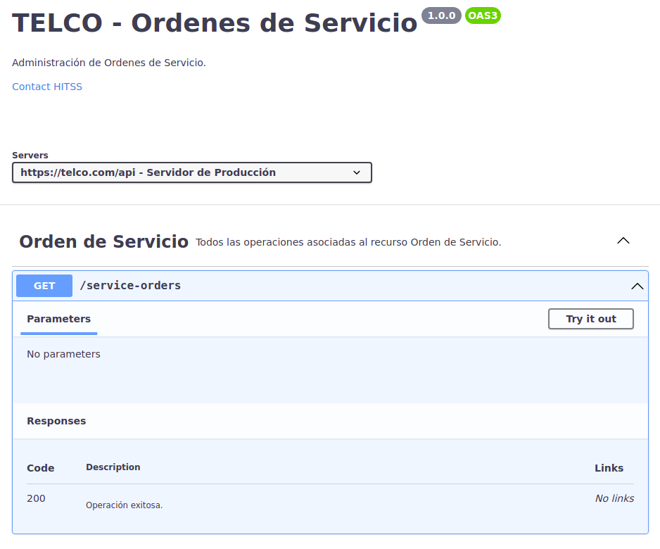


### Paths & Operations

Permiten definir los endpoints individuales (`paths`) de una API y el tipo de métodos HTTP `operations` que son soportadas. 

Dentro de un path se definen los siguiente elementos.

| Parámetro | Descripción | Ejemplo | Referencia |
| --- | --- | --- | --- |
| path | Nombre descriptivo de la ruta (recurso). |  `service-orders` | path |
| method | Tipo de método HTTP: `get`, `post`, `put`, `delete`, options, head, patch, trace. | `get` | operation |
| operationId | Identificador único utilizado para identificar la operación (se recomienda su definición). | `getAllServiceOrders` | operation |
| summary | Resumen de la funcionalidad expuesta por el recurso. | `Obtener todas las Ordenes de Servicio.` | path |
| description | Descripción detallada del recurso. | `Esta operación permite obtener la información de todas las ordenes de servicio.` | path |
| parameters | Información de parámetros, si son necesarios para la operación. |  `header` | path |
| responses | Tipo de respuesta e información asociada a la operación. |  Documento Json | operation |

```yaml
paths:
  /service-orders:
    get:
      tags:
      - Orden de Servicio
      summary: Obtener las Ordenes de Servicio.
      description: Esta operación obtiene la información de todas las ordenes de servicio.
      operationId: getAllServiceOrders
      parameters:
      - name: api_key
        in: header
        description: Token de autorización de uso del API.
        required: true
        schema:
          type: string
        example: 97czXdXt76ti9Til2S70cdmwtbLWApcs
      responses:
        200:
          description: Operación exitosa.
          content: {}
        400:
          description: Solicitud incorrecta.
          content: {}
```

### Parameters

Las operaciones pueden tener diferentes tipos de parámetros.

| Tipo | Descripción | Ejemplo |
| --- | --- | --- |
| Path | El valor del parámetro es parte de la ruta en la URL . |  /resource/{parameter} |
| Query | Los parámetros son agregados al final de la URL. |  /resource?parameter=value |
| Header | Son headers personalizados que son parte del request. |  ParameterName : value |
| Cookie | Utilizado para pasar el valor de una cookie al servicio.| |

| Tipo | Descripción |
| --- | --- |
| Request Body | Describe el cuerpo de una `request`.|

La selección del tipo de parámetro a utilizar está en relación con el tipo de operación que se va a implementar.

## 4.5. Operación GET

En este punto se ha definido una REST API que expone el recurso `service-orders` a través de la operación `get` y que requiere un parámetro de tipo `header`.

Para crear una operación que obtenga una `ServiceOrder` a partir de un **ID específico** es necesario definir la siguiente estructura.

```yaml
  /service-orders/{serviceOrderId}:
    get:
      tags:
      - Orden de Servicio
      summary: Obtener una Orden de Servicio por identificador único.
      description: Esta operación obtiene la información de una orden de servicio
        por medio de su id.
      operationId: getServiceOrderById
      parameters:
      - name: api_key
        in: header
        description: Token de autorización de uso del API.
        required: true
        schema:
          type: string
        example: 97czXdXt76ti9Til2S70cdmwtbLWApcs
      - name: serviceOrderId
        in: path
        description: Identificador único de la Orden de Servicio.
        required: true
        schema:
          type: integer
      responses:
        200:
          description: Operación exitosa.
          content: {}
        400:
          description: Solicitud incorrecta.
          content: {}
```

En esta nueva operación se pueden identificar los siguientes puntos:

* Dentro del ruta del recurso se encuentra el parámetro `{serviceOrderId}` que es de tipo `Path`.
* Dentro de la sección parámetros (`parameters`) se encuentra la definición del parámetro que indica que es tipo `path`, que es un valor de tipo entero y que es requerido.


### Media Types

Definen los tipos `MIME` que son soportados por el API.

```yaml
  content:
    application/json:
      schema:
        type: array
        items:
          $ref: '#/components/schemas/...'
```
Algunos de los posibles tipos a definir son:

* application/json
* application/xml
* application/javascript
* text/plain
* text/html


### Responses

Para cada operación que se diseña, se puede definir un esquema (`schema`) que forma parte del cuerpo de la respuesta (`response`), y de la misma forma se pueden definir los códigos de respuesta asociados, por ejemplo:

* 200 - OK
* 404 - No encontrado

En la siguiente estructura se define un esquema con la información de una `ServiceOrder`.

```yaml
          content:
            application/json:
              schema:
                type: object
                properties:
                  id:
                    type: integer
                    description: Identificador único de la Orden de Servicio.
                    example: 1
                  soType:
                    maxLength: 10
                    minLength: 2
                    type: string
                    description: Tipo de Orden de Servicio.
                    example: OS
                  phoneNumber:
                    maxLength: 10
                    minLength: 10
                    type: string
                    description: Referencia del servicio.
                    example: "5400000555"
                  imsProfile:
                    maxLength: 10
                    minLength: 5
                    type: string
                    description: Nombre del perfil IMS.
                    example: Huawei
                  data:
                    maxLength: 50
                    minLength: 0
                    type: string
                    description: Información adicional del servicio.
                    example: Data available
```

Este esquema puede ser asociado de forma directa a una operación.

```yaml
  /service-orders/{serviceOrderId}:
    get:
      tags:
      - Orden de Servicio
      summary: Obtener una Orden de Servicio por identificador único.
      description: Esta operación obtiene la información de una orden de servicio
        por medio de su id.
      operationId: getServiceOrderById
      parameters:
      - name: api_key
        in: header
        description: Token de autorización de uso del API.
        required: true
        schema:
          type: string
        example: 97czXdXt76ti9Til2S70cdmwtbLWApcs
      - name: serviceOrderId
        in: path
        description: Identificador único de la Orden de Servicio.
        required: true
        schema:
          type: integer
      responses:
        200:
          description: Operación exitosa.
          content:
            application/json:
              schema:
                type: object
                properties:
                  id:
                    type: integer
                    description: Identificador único de la Orden de Servicio.
                    example: 1
                  soType:
                    maxLength: 10
                    minLength: 2
                    type: string
                    description: Tipo de Orden de Servicio.
                    example: OS
                  phoneNumber:
                    maxLength: 10
                    minLength: 10
                    type: string
                    description: Referencia del servicio.
                    example: "5400000555"
                  imsProfile:
                    maxLength: 10
                    minLength: 5
                    type: string
                    description: Nombre del perfil IMS.
                    example: Huawei
                  data:
                    maxLength: 50
                    minLength: 0
                    type: string
                    description: Información adicional del servicio.
                    example: Data available
        400:
          description: Solicitud incorrecta.
          content: {}
```

### Input & Output Schemas

Existe una sección global denominada `components` que permite definir estructuras de datos comunes que son utilizadas en el API.

Para hacer uso de un modelo se hace una referencia `$ref` hacia un esquema definido.

Los modelos (`models`) pueden ser utilizados en los `requests` y `responses`.

Dentro de la siguiente estructura se puede identificar que el esquema tiene un nombre asociado `ServiceOrder`, se identifican las propiedades que son requeridas y se ha asignado una descripción.

```yaml
components:
  schemas:
    ServiceOrder:
      required:
      - imsProfile
      - phoneNumber
      - soType
      type: object
      properties:
        id:
          type: integer
          description: Identificador único de la Orden de Servicio.
          example: 1
        soType:
          maxLength: 10
          minLength: 2
          type: string
          description: Tipo de Orden de Servicio.
          example: OS
        phoneNumber:
          maxLength: 10
          minLength: 10
          type: string
          description: Referencia del servicio.
          example: "5400000555"
        imsProfile:
          maxLength: 10
          minLength: 5
          type: string
          description: Nombre del perfil IMS.
          example: Huawei
        data:
          maxLength: 50
          minLength: 0
          type: string
          description: Información adicional del servicio.
          example: Data available
      description: Parámetros de una Orden de Servicio.
```

Una vez definido el esquema se puede hacer referencia dentro de la operación correspondiente.

```yaml
      responses:
        200:
          description: Operación exitosa.
          content:
            application/json:
              schema:
                $ref: '#/components/schemas/ServiceOrder'
        400:
          description: Solicitud incorrecta.
          content: {}
```

En este punto se puede definir todos los esquemas que son requeridos por nuestra API. 

Es importante mencionar que puede haber referencia entre esquemas, por ejemplo el esquema `ServiceOrderArray` que es un `array` tiene una referencia al esquema `ServiceOrder`.

```yaml
    ServiceOrderArray:
      type: object
      properties:
        collection:
          type: array
          description: Arreglo de Ordenes de Servicio.
          items:
            $ref: '#/components/schemas/ServiceOrder'
```

```yaml
    ApiResponse:
      required:
      - code
      - message
      type: object
      properties:
        code:
          maxLength: 7
          minLength: 6
          type: string
          description: Código de respuesta retornada por el servicio.
          example: 997-20
        message:
          maxLength: 100
          minLength: 1
          type: string
          description: Mensaje informativo retornado por el servicio.
          example: Solicitud procesada por el servicio.
      description: Código de respuesta de servicio.
```
Una vez creados los esquemas se puede actualizar sus referencias dentro de la operaciones.

```yaml
  /service-orders:
    get:
      tags:
      - Orden de Servicio
      summary: Obtener las Ordenes de Servicio.
      description: Esta operación obtiene la información de todas las ordenes de servicio.
      operationId: getAllServiceOrders
      parameters:
      - name: api_key
        in: header
        description: Token de autorización de uso del API.
        required: true
        schema:
          type: string
        example: 97czXdXt76ti9Til2S70cdmwtbLWApcs
      responses:
        200:
          description: Operación exitosa.
          content:
            application/json:
              schema:
                $ref: '#/components/schemas/ServiceOrderArray'
        400:
          description: Solicitud incorrecta.
          content:
            application/json:
              schema:
                $ref: '#/components/schemas/ApiResponse'

  /service-orders/{serviceOrderId}:
    get:
      tags:
      - Orden de Servicio
      summary: Obtener una Orden de Servicio por identificador único.
      description: Esta operación obtiene la información de una orden de servicio
        por medio de su id.
      operationId: getServiceOrderById
      parameters:
      - name: api_key
        in: header
        description: Token de autorización de uso del API.
        required: true
        schema:
          type: string
        example: 97czXdXt76ti9Til2S70cdmwtbLWApcs
      - name: serviceOrderId
        in: path
        description: Identificador único de la Orden de Servicio.
        required: true
        schema:
          type: integer
      responses:
        200:
          description: Operación exitosa.
          content:
            application/json:
              schema:
                $ref: '#/components/schemas/ServiceOrder'
        400:
          description: Solicitud incorrecta.
          content:
            application/json:
              schema:
                $ref: '#/components/schemas/ApiResponse'
```

En este punto se puede visualizar nuestra `REST API` con sus `operations` y `schemas`.

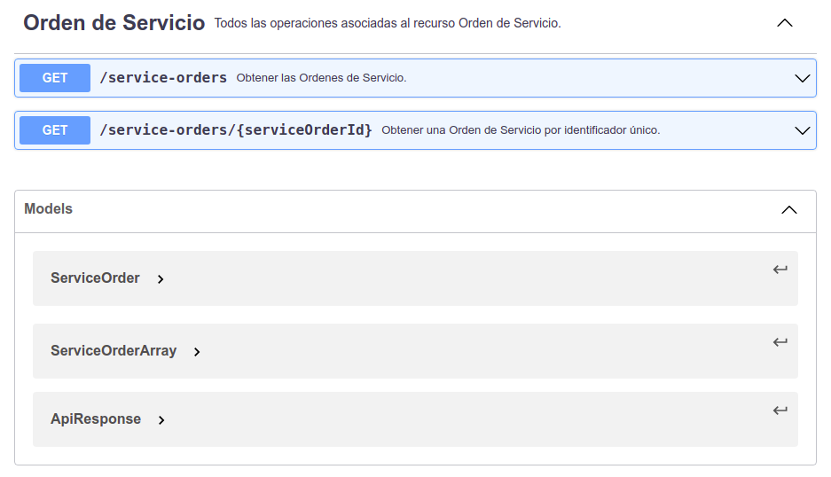


## 4.6. Operación POST

Para definir una operación que permita crear una nueva `ServiceOrder` se necesita documentar la siguiente estructura que bajo el path `/service-orders`.

```yaml
    post:
      tags:
      - Orden de Servicio
      summary: Crear una Orden de Servicio.
      description: Esta operación permite crear una nueva orden de servicio.
      operationId: createServiceOrder
      parameters:
      - name: api_key
        in: header
        description: Token de autorización de uso del API.
        required: true
        schema:
          type: string
        example: 97czXdXt76ti9Til2S70cdmwtbLWApcs
      requestBody:
        content:
          application/json:
            schema:
              $ref: '#/components/schemas/ServiceOrder'
        required: true
      responses:
        201:
          description: Operación exitosa.
          content:
            application/json:
              schema:
                $ref: '#/components/schemas/ServiceOrder'
        400:
          description: Solicitud incorrecta.
          content:
            application/json:
              schema:
                $ref: '#/components/schemas/ApiResponse'
```

En esta definición se puede identificar que la operación requiere como parámetro de entrada un `body` de tipo `Json` que está definido en el esquema `ServiceOrder`.

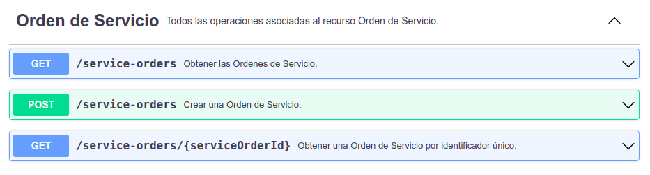

## 4.7. Operación PUT

Para definir una operación que permita actualizar una `ServiceOrder` se necesita documentar la siguiente estructura que bajo el path `/service-orders/{serviceOrderId}`.

```yaml
    put:
      tags:
      - Orden de Servicio
      summary: Actualizar una Orden de Servicio.
      description: Esta operación actualiza la información de una orden de servicio
        por medio de su id.
      operationId: updateServiceOrderById
      parameters:
      - name: api_key
        in: header
        description: Token de autorización de uso del API.
        required: true
        schema:
          type: string
        example: 97czXdXt76ti9Til2S70cdmwtbLWApcs
      - name: serviceOrderId
        in: path
        description: Identificador único de la Orden de Servicio.
        required: true
        schema:
          type: integer
      requestBody:
        content:
          application/json:
            schema:
              $ref: '#/components/schemas/ServiceOrder'
        required: true
      responses:
        200:
          description: Operación exitosa.
          content:
            application/json:
              schema:
                $ref: '#/components/schemas/ApiResponse'
        400:
          description: Solicitud incorrecta.
          content:
            application/json:
              schema:
                $ref: '#/components/schemas/ApiResponse'
```

En esta definición se puede identificar que la operación requiere como parámetros de entrada:

* Un parámetro de tipo `Path`.
* Un `body` de tipo `Json` es está definido en el esquema `ServiceOrder`.

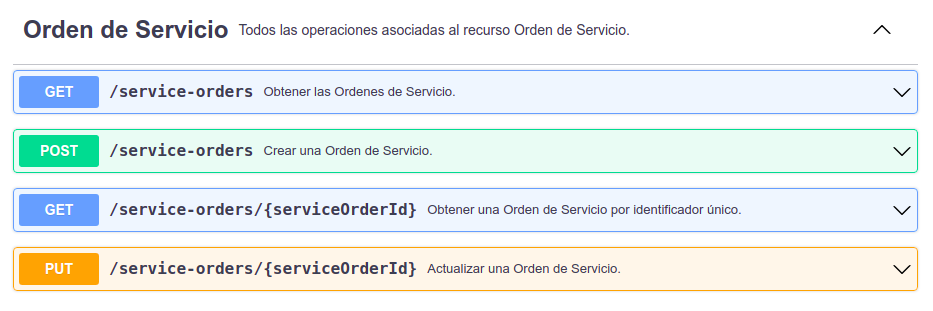


## 4.8. Operación DELETE

Para definir una operación que permita eliminar una `ServiceOrder` se necesita documentar la siguiente estructura que bajo el path `/service-orders/{serviceOrderId}`.

```yaml
    delete:
      tags:
      - Orden de Servicio
      summary: Eliminar una Orden de Servicio.
      description: Esta operación permite eliminar una orden de servicio por medio
        de su id.
      operationId: deleteServiceOrderById
      parameters:
      - name: api_key
        in: header
        description: Token de autorización de uso del API.
        required: true
        schema:
          type: string
        example: 97czXdXt76ti9Til2S70cdmwtbLWApcs
      - name: serviceOrderId
        in: path
        description: Identificador único de la Orden de Servicio.
        required: true
        schema:
          type: integer
      responses:
        200:
          description: Operación exitosa.
          content:
            application/json:
              schema:
                $ref: '#/components/schemas/ApiResponse'
        400:
          description: Solicitud incorrecta.
          content:
            application/json:
              schema:
                $ref: '#/components/schemas/ApiResponse'
```
En esta definición se puede identificar que la operación requiere como parámetros de entrada un parámetro de tipo `Path`.

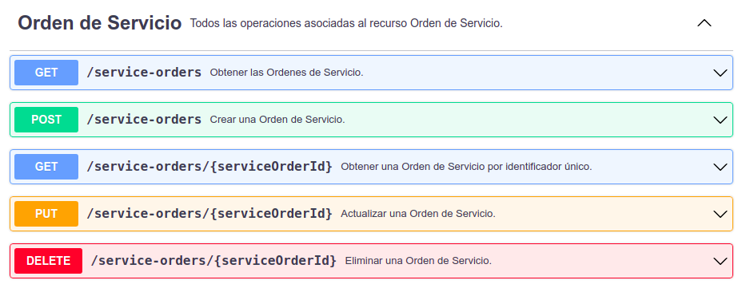

# 5. Ejemplo de especificación REST API OAS 3.0.1

```yaml
openapi: 3.0.1
info:
  title: EMPRESA - Ordenes de Servicio
  description: Administración de Ordenes de Servicio.
  contact:
    name: Desarrollo
    email: development@empresa.com
  version: 1.0.0

servers:
- url: http://development.empresa.com/api
  description: Servidor de Desarrollo
- url: https://staging.empresa.com/api
  description: Servidor de Pruebas
- url: https://empresa.com/api
  description: Servidor de Producción

tags:
- name: Orden de Servicio
  description: Todos las operaciones asociadas al recurso Orden de Servicio.

paths:
  /service-orders:
    get:
      tags:
      - Orden de Servicio
      summary: Obtener las Ordenes de Servicio.
      description: Esta operación obtiene la información de todas las ordenes de servicio.
      operationId: getAllServiceOrders
      parameters:
      - name: api_key
        in: header
        description: Token de autorización de uso del API.
        required: true
        schema:
          type: string
        example: 97czXdXt76ti9Til2S70cdmwtbLWApcs
      responses:
        200:
          description: Operación exitosa.
          content:
            application/json:
              schema:
                $ref: '#/components/schemas/ServiceOrderArray'
        400:
          description: Solicitud incorrecta.
          content:
            application/json:
              schema:
                $ref: '#/components/schemas/ApiResponse'

    post:
      tags:
      - Orden de Servicio
      summary: Crear una Orden de Servicio.
      description: Esta operación permite crear una nueva orden de servicio.
      operationId: createServiceOrder
      parameters:
      - name: api_key
        in: header
        description: Token de autorización de uso del API.
        required: true
        schema:
          type: string
        example: 97czXdXt76ti9Til2S70cdmwtbLWApcs
      requestBody:
        content:
          application/json:
            schema:
              $ref: '#/components/schemas/ServiceOrder'
        required: true
      responses:
        201:
          description: Operación exitosa.
          content:
            application/json:
              schema:
                $ref: '#/components/schemas/ServiceOrder'
        400:
          description: Solicitud incorrecta.
          content:
            application/json:
              schema:
                $ref: '#/components/schemas/ApiResponse'

  /service-orders/{serviceOrderId}:
    get:
      tags:
      - Orden de Servicio
      summary: Obtener una Orden de Servicio por identificador único.
      description: Esta operación obtiene la información de una orden de servicio
        por medio de su id.
      operationId: getServiceOrderById
      parameters:
      - name: api_key
        in: header
        description: Token de autorización de uso del API.
        required: true
        schema:
          type: string
        example: 97czXdXt76ti9Til2S70cdmwtbLWApcs
      - name: serviceOrderId
        in: path
        description: Identificador único de la Orden de Servicio.
        required: true
        schema:
          type: integer
      responses:
        200:
          description: Operación exitosa.
          content:
            application/json:
              schema:
                $ref: '#/components/schemas/ServiceOrder'
        400:
          description: Solicitud incorrecta.
          content:
            application/json:
              schema:
                $ref: '#/components/schemas/ApiResponse'

    put:
      tags:
      - Orden de Servicio
      summary: Actualizar una Orden de Servicio.
      description: Esta operación actualiza la información de una orden de servicio
        por medio de su id.
      operationId: updateServiceOrderById
      parameters:
      - name: api_key
        in: header
        description: Token de autorización de uso del API.
        required: true
        schema:
          type: string
        example: 97czXdXt76ti9Til2S70cdmwtbLWApcs
      - name: serviceOrderId
        in: path
        description: Identificador único de la Orden de Servicio.
        required: true
        schema:
          type: integer
      requestBody:
        content:
          application/json:
            schema:
              $ref: '#/components/schemas/ServiceOrder'
        required: true
      responses:
        200:
          description: Operación exitosa.
          content:
            application/json:
              schema:
                $ref: '#/components/schemas/ApiResponse'
        400:
          description: Solicitud incorrecta.
          content:
            application/json:
              schema:
                $ref: '#/components/schemas/ApiResponse'

    delete:
      tags:
      - Orden de Servicio
      summary: Eliminar una Orden de Servicio.
      description: Esta operación permite eliminar una orden de servicio por medio
        de su id.
      operationId: deleteServiceOrderById
      parameters:
      - name: api_key
        in: header
        description: Token de autorización de uso del API.
        required: true
        schema:
          type: string
        example: 97czXdXt76ti9Til2S70cdmwtbLWApcs
      - name: serviceOrderId
        in: path
        description: Identificador único de la Orden de Servicio.
        required: true
        schema:
          type: integer
      responses:
        200:
          description: Operación exitosa.
          content:
            application/json:
              schema:
                $ref: '#/components/schemas/ApiResponse'
        400:
          description: Solicitud incorrecta.
          content:
            application/json:
              schema:
                $ref: '#/components/schemas/ApiResponse'

components:
  schemas:
    ServiceOrder:
      required:
      - imsProfile
      - phoneNumber
      - soType
      type: object
      properties:
        id:
          type: integer
          description: Identificador único de la Orden de Servicio.
          example: 101
        soType:
          maxLength: 10
          minLength: 2
          type: string
          description: Tipo de Orden de Servicio.
          example: OS
        phoneNumber:
          maxLength: 10
          minLength: 10
          type: string
          description: Referencia del servicio.
          example: "5400000555"
        imsProfile:
          maxLength: 10
          minLength: 5
          type: string
          description: Nombre del perfil IMS.
          example: Huawei
        data:
          maxLength: 50
          minLength: 0
          type: string
          description: Información adicional del servicio.
          example: Data available
      description: Parámetros de una Orden de Servicio.

    ServiceOrderArray:
      type: object
      properties:
        collection:
          type: array
          description: Arreglo de Ordenes de Servicio.
          items:
            $ref: '#/components/schemas/ServiceOrder'

    ApiResponse:
      required:
      - code
      - message
      type: object
      properties:
        code:
          maxLength: 7
          minLength: 6
          type: string
          description: Código de respuesta retornada por el servicio.
          example: 997-20
        message:
          maxLength: 100
          minLength: 1
          type: string
          description: Mensaje informativo retornado por el servicio.
          example: Solicitud procesada por el servicio.
      description: Código de respuesta de servicio.
```


# 6. Anexos

## 6.1 HTTP/1.1

La siguiente información fue tomada de https://somostechies.com/que-es-http2/ y muestra una vista general del protocolo HTTP.

> HTTP (Hypertext Transfer Protocol) es el protocolo que permite la transferencia de información a través de la web. Este protocolo fue lanzado en 1991 y desde ahí ha ido evolucionando hasta llegar a la versión que es más ampliamente conocida, la 1.1.

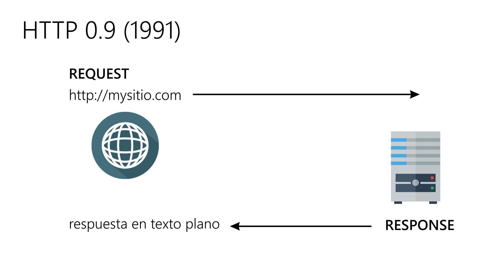


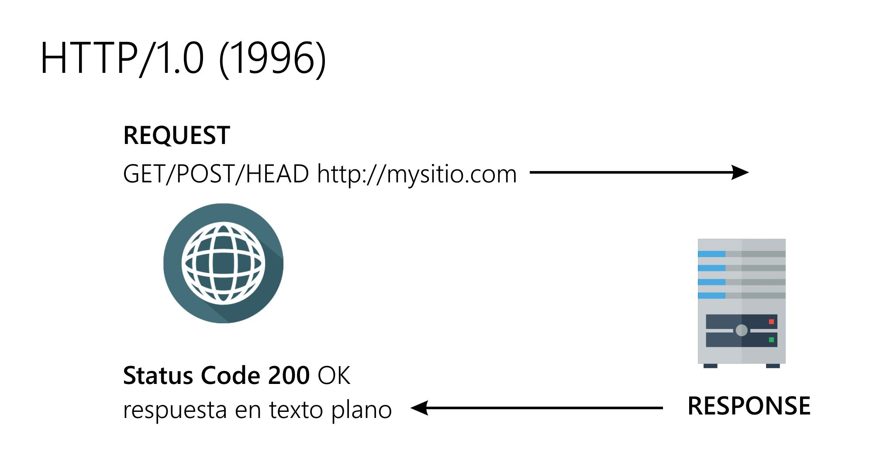
[https://datatracker.ietf.org/doc/html/rfc1945](https://datatracker.ietf.org/doc/html/rfc1945)


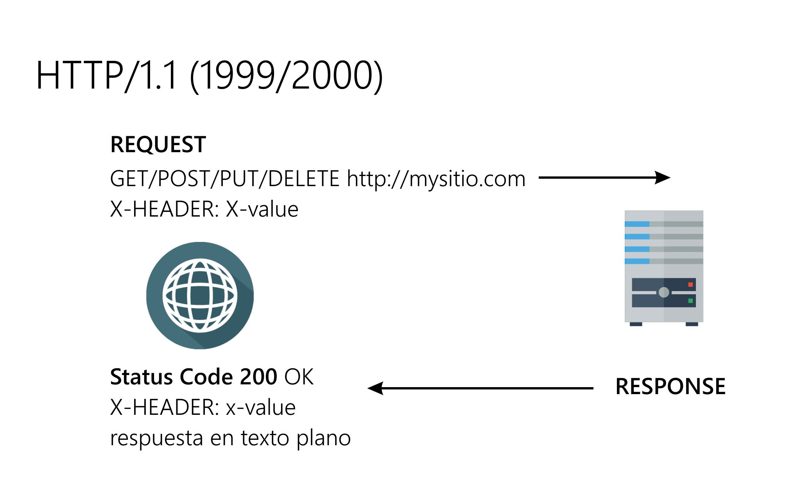
[https://datatracker.ietf.org/doc/html/rfc2616](https://datatracker.ietf.org/doc/html/rfc2616)

**HTTP 1.2**
[https://datatracker.ietf.org/doc/html/rfc7540](https://datatracker.ietf.org/doc/html/rfc7540)

## 6.2 Response Codes

La siguiente tabla provee detalle de los códigos de respuesta, escenarios típicos y qué información puede esperarse dentro del cuerpo de la respuesta.


| Response Code | Descripción |
| --- | --- |
| `200 OK` | Solicitud aceptada, la respuesta contiene el resultado. Este es un código de respuesta de propósito general que se puede devolver desde cualquier solicitud. Para las solicitudes **GET**, el recurso o los datos solicitados se encuentran en el cuerpo de la respuesta. Para las solicitudes **PUT** o **DELETE**, la solicitud se realizó correctamente y la información sobre el resultado (como nuevos identificadores de recursos o cambios en el estado de los recursos) se puede encontrar en el cuerpo de la respuesta. |
| `201 CREATED` | Este código de respuesta se devuelve desde **PUT** o **POST** e indica que se creó correctamente un nuevo recurso. El cuerpo de la respuesta puede contener, por ejemplo, información sobre un nuevo recurso o información de validación (por ejemplo, cuando se actualiza un activo). |
| `204 NO CONTENT` | Indica que la solicitud fue aceptada pero que no había nada que devolver. Se devuelve cuando se procesó la solicitud, pero no se devolvió información adicional sobre el resultado. |
| `400 BAD REQUEST` | La solicitud no fue válida. Este código se devuelve cuando el servidor ha intentado procesar la solicitud, pero algún aspecto de la solicitud no es válido, por ejemplo, un recurso formateado incorrectamente o un intento de implementar un proyecto de evento no válido en el tiempo de ejecución del evento. La información sobre la solicitud se proporciona en el cuerpo de la respuesta e incluye un código de error y un mensaje de error. |
| `401 UNAUTHORIZED` | Se devuelve desde el servidor de aplicaciones cuando la seguridad de la aplicación está habilitada y faltaba información de autorización en la solicitud.|
| `403 FORBIDDEN` | Indica que el cliente intentó acceder a un recurso al que no tiene acceso. Esto puede ocurrir si el usuario que accede al recurso remoto no tiene suficientes privilegios. |
| `404 NOT FOUND` | Indica que el recurso de destino no existe. Esto puede deberse a que el URI tiene un formato incorrecto o se ha eliminado el recurso. |
| `405 METHOD NOT ALLOWED` | Se devuelve cuando el recurso de destino no admite el método HTTP solicitado; por ejemplo, el recurso de funciones solo permite operaciones **GET**. |
| `406 NOT ACCEPTABLE` | El formato de datos solicitado en el encabezado Accept o el parámetro accept no es compatible con el recurso de destino. Es decir, el cliente ha solicitado que los datos se devuelvan en un formato particular, pero el servidor no puede devolver datos en ese formato. |
| `409 CONFLICT` | Indica que se ha detectado un cambio conflictivo durante un intento de modificar un recurso. El cuerpo de respuesta proporciona más información. |
| `415 UNSUPPORTED MEDIA TYPE` | El formato de datos del cuerpo de la solicitud, especificado en el encabezado Content-Type, no es compatible con el recurso de destino. |
| `500 INTERNAL SERVER ERROR` | Se produjo un error interno en el servidor. Esto podría indicar un problema con la solicitud o podría indicar un problema en el código del lado del servidor. La información de error se puede encontrar en el cuerpo de la respuesta. |


[https://www.ibm.com/docs/en/odm/8.8.1?topic=api-rest-response-codes-error-messages](https://www.ibm.com/docs/en/odm/8.8.1?topic=api-rest-response-codes-error-messages)

## 6.3 Best Practices

Existen diferentes autores que hablan sobre `Best Practices` en el desarrollo de REST API. A continuación se listan los puntos que cada autor menciona y se indican los que han sido cubiertos en el presente documento.

### REST API Best Practices - REST Endpoint Design Examples

| Característica | ¿se cumple? |
| --- | --- |
| 1. Use JSON as the Format for Sending and Receiving Data | sí |
| 2. Use Nouns Instead of Verbs in Endpoints | sí |
| 3. Name Collections with Plural Nouns | sí |
| 4. Use Status Codes in Error Handling | sí |
| 5. Use Nesting on Endpoints to Show Relationships | |
| 6. Use Filtering, Sorting, and Pagination to Retrieve the Data Requested | |
| 7. Use SSL for Security | sí |
| 8. Be Clear with Versioning | sí |
| 9. Provide Accurate API Documentation | sí |

[https://www.freecodecamp.org/news/rest-api-best-practices-rest-endpoint-design-examples/](https://www.freecodecamp.org/news/rest-api-best-practices-rest-endpoint-design-examples/)


### 9 Trending Best Practices for REST API Development

| Característica | ¿se cumple? |
| --- | --- |
| 1. REST API must accept and respond with Json | sí |
| 2. Go with error status codes | sí |
| 3. Don't use verbs in URLs | sí |
| 4. Use plural nouns to name a collection | sí |
| 5. Well compiled documentation | sí |
| 6. Return error details in the response body | sí |
| 7. Use resource nesting | |
| 8. Use SSL/TLS | sí |
| 9. Secure your API | |

[https://www.partech.nl/nl/publicaties/2020/07/9-trending-best-practices-for-rest-api-development#](https://www.partech.nl/nl/publicaties/2020/07/9-trending-best-practices-for-rest-api-development#)


### RESTful web API design

| Característica | ¿se cumple? |
| --- | --- |
| 1. Organize the API design around resources | sí |
| 2. Define API operations in terms of HTTP methods | sí |
| 3. Conform to HTTP semantics | sí |
| 4. Asynchronous operations | |
| 5. Filter and paginate data | |
| 6. Support partial responses for large binary resources | |
| 7. Use HATEOAS to enable navigation to related resources | |
| 8. Versioning a RESTful web API | sí |

[https://docs.microsoft.com/en-us/azure/architecture/best-practices/api-design](https://docs.microsoft.com/en-us/azure/architecture/best-practices/api-design)


### Best Practices in API Design

| Característica | ¿se cumple? |
| --- | --- |
| 1. Characteristics of a well-designed API | |
| 1.1 Easy to read and work with | sí |
| 1.2. Hard to misuse | sí |
| 1.3. Complete and concise | sí |
| 2. Collections, Resources, and their URLs | |
| 2.1. Understanding resources and collections | sí |
| 2.2. Nouns describe URLs better | sí |
| 2.3. Describe resource functionality with HTTP methods | sí |
| 3. Responses | |
| 3.1. Give feedback to help developers succeed | sí |
| 3.2. Give examples for all your GET responses | sí |
| 4. Requests | |
| 4.1. Handle complexity elegantly | |

[https://swagger.io/resources/articles/best-practices-in-api-design/](https://swagger.io/resources/articles/best-practices-in-api-design/)
